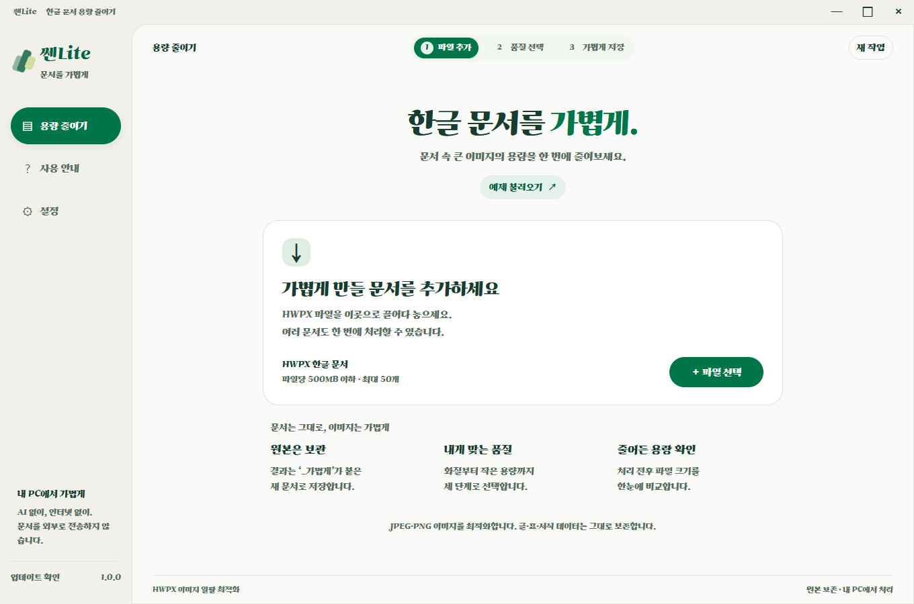
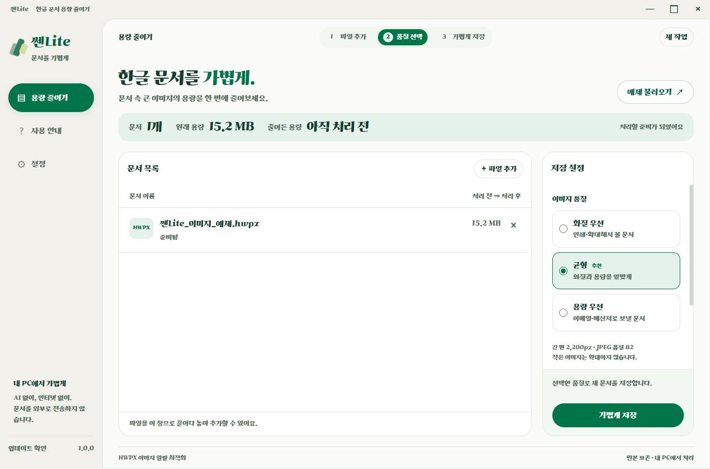
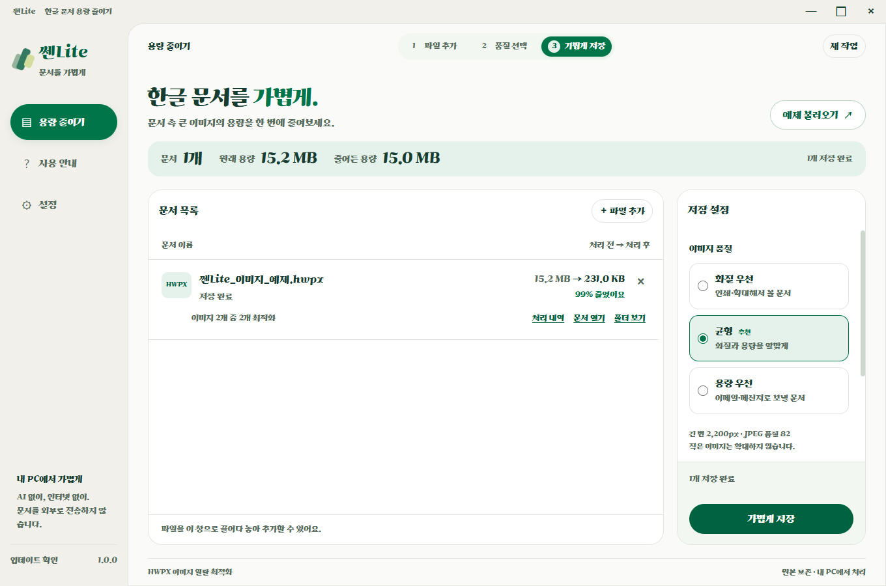
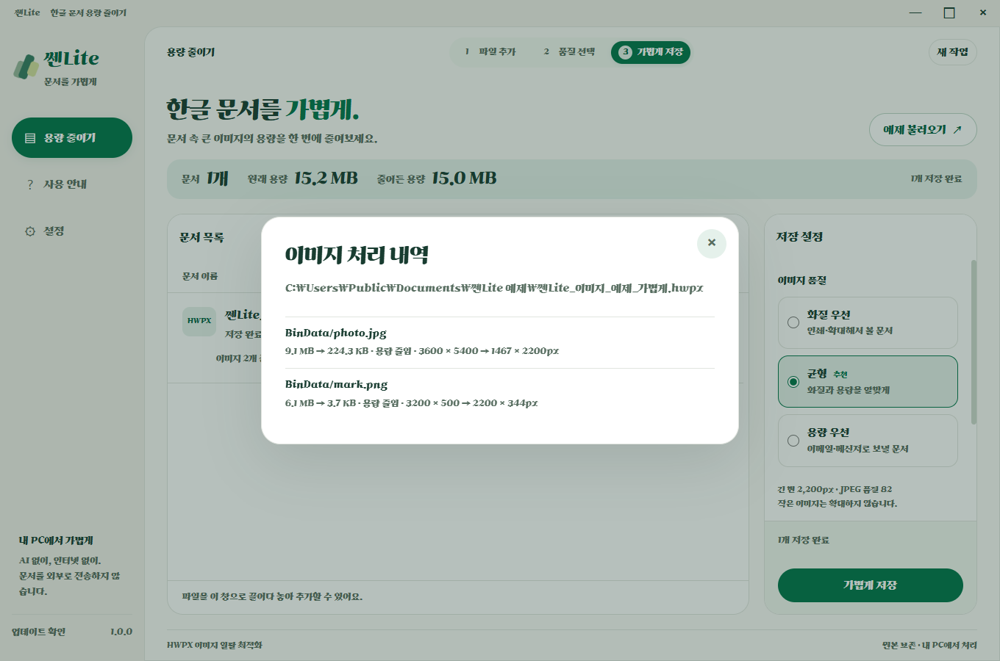
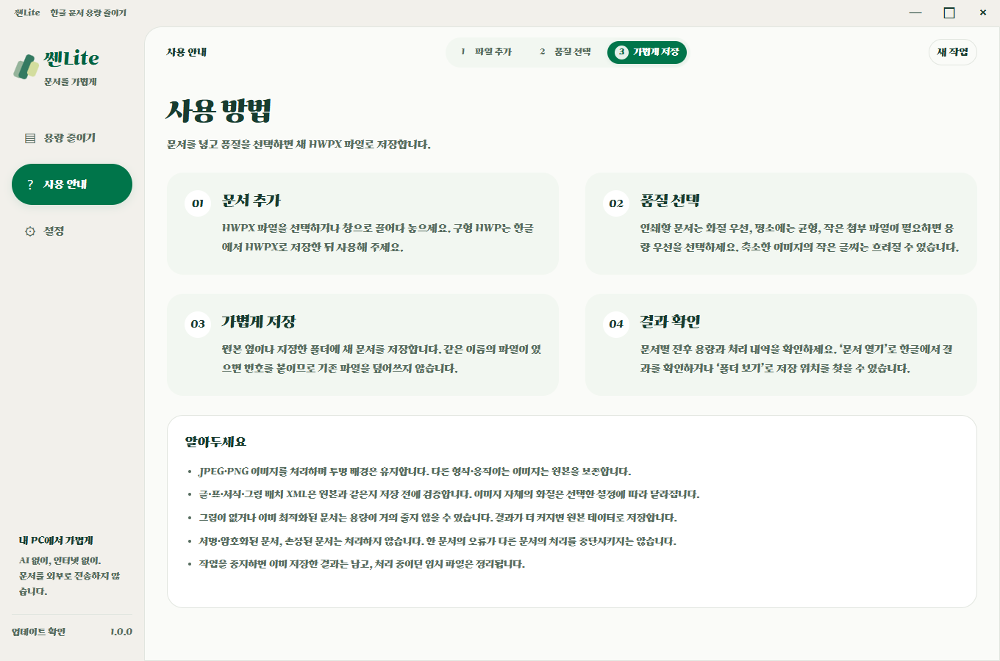

# 쎈Lite

HWPX 안의 JPEG·PNG 이미지를 일괄 최적화하여 새 문서로 저장하는 Windows 앱. AI, API 키, 한컴 설치, 인터넷 연결 없이 문서를 처리합니다. 업데이트 확인에만 인터넷을 사용합니다.

## 다운로드

- [Windows 설치 파일](https://github.com/HooniKims/ssen-lite/releases/download/v1.0.0/SsenLite-Setup-1.0.0.exe)
- [설치 없이 실행하는 ZIP](https://github.com/HooniKims/ssen-lite/releases/download/v1.0.0/SsenLite-1.0.0-x64.zip): 전체 압축 해제 후 `SsenLite.exe` 실행
- [최신 릴리즈와 변경 내용](https://github.com/HooniKims/ssen-lite/releases/latest)

Windows 10/11 x64용입니다. 설치형은 앱에서 새 버전을 확인하고 내려받을 수 있습니다.

## 예제로 살펴보기

아래는 앱에 포함된 예제 문서를 실제 Windows 배포본에서 처리한 화면입니다. 예제의 감소율은 실제 문서마다 다릅니다.

### 1. 문서 추가

HWPX 파일을 끌어 놓거나 파일 선택으로 추가합니다. 여러 문서를 한 번에 처리할 수 있고, **예제 불러오기**로 바로 체험할 수 있습니다.



### 2. 용도에 맞게 품질 선택

인쇄용 문서는 화질 우선, 일반 공유는 균형, 작은 첨부 파일이 필요하면 용량 우선을 선택합니다. 저장 폴더도 지정할 수 있습니다.



### 3. 줄어든 용량 확인

**가볍게 저장**을 누르면 문서별 전후 크기와 절감량을 보여줍니다. 이 예제에서는 15.2MB가 231KB로 줄었습니다. 원본은 유지하고 `_가볍게`가 붙은 새 파일로 저장합니다.



### 4. 이미지별 처리 내역

각 그림의 원래 크기, 결과 크기, 해상도 변화와 처리 사유를 확인할 수 있습니다. 처리하지 않은 그림도 사유와 함께 표시합니다.



### 5. 앱 안에서 사용 방법 확인

문서 추가부터 저장까지의 순서와 지원 형식, 취소 시 동작을 안내합니다. 구형 `.hwp`는 한글에서 `.hwpx`로 저장한 뒤 사용합니다.



[소개용 스크린샷 5장 다운로드](https://github.com/HooniKims/ssen-lite/releases/download/v1.0.0/SsenLite-Screenshots-1.0.0.zip)

## 사용

1. HWPX 파일을 선택하거나 창으로 끌어 놓습니다. 파일당 최대 500MB, 한 번에 최대 50개입니다.
2. 화질 우선 / 균형 / 용량 우선을 선택합니다.
3. 저장 위치를 지정하고 **가볍게 저장**을 누릅니다. 기본 위치는 각 원본 폴더입니다.
4. `문서명_가볍게.hwpx`로 저장합니다. 이미 존재하면 번호를 붙이며 원본을 덮어쓰지 않습니다.

| 설정 | 최대 긴 변 | JPEG 품질 |
|---|---:|---:|
| 화질 우선 | 3,200px | 90 |
| 균형 | 2,200px | 82 |
| 용량 우선 | 1,400px | 70 |

이미지는 확대하지 않습니다. PNG는 투명도를 유지하며 팔레트 감색을 하지 않습니다. 축소한 이미지의 작은 글씨는 흐려질 수 있습니다. GIF·BMP·TIFF·벡터·애니메이션·OLE 개체는 원본 보존 대상입니다. 파일별 감소 폭은 다르며, 결과 전체가 커지면 원본 바이트로 사본을 저장합니다.

## 문서 보존

- OpenHWP의 `hwpx` Rust 크레이트로 `Contents/content.hpf`의 파일 목록을 읽습니다. 저장소 커밋과 Cargo.lock을 고정했습니다.
- JPEG와 PNG의 **형식을 바꾸지 않고** 내장 이미지 데이터만 교체합니다.
- 글·표·서식·그림의 위치/회전/자르기 정보를 포함한 XML, 첨부 개체 등은 재직렬화하지 않습니다.
- 저장 결과를 다시 열어 변경한 이미지 외 모든 파일의 SHA-256을 원본과 비교하고 ZIP CRC를 확인합니다.
- 저장은 임시 파일에서 검증 후 새 이름으로 확정합니다. 취소 시 임시 파일을 정리합니다.
- 전자서명·암호화·손상된 문서는 거부합니다. 내부 데이터 한도: 합계 1GB, 항목당 256MB, XML당 32MB, 이미지당 8천만 픽셀.
- 미리보기 이미지와 텍스트는 원본 그대로 보존합니다. 파일 형식 구조 검사와 실제 한글의 모든 버전 호환성을 동일시하지 않습니다.

## 개발

Node.js 24+, Rust 1.96+ 및 Windows C++ 빌드 도구가 필요합니다. 사용자 배포본에는 컴파일된 문서 엔진과 이미지 라이브러리가 포함됩니다.

```powershell
npm install
npm run build:native
npm start
npm test
npm run test:ui
npm run dist
```

샘플 재생성은 `npm run samples`입니다. 샘플은 쎈Pick의 설치 이미지와 공개 기본 HWPX 틀에서 만들었으며 개인정보가 없습니다. `scripts/sample-base`와 `scripts/create-samples.cjs`가 재현 자료입니다.

복합 양식 6종·3단계 설정과 실제 한글 렌더 비교, 배포 앱 일괄 처리 검증은 [검증 기록](docs/TESTING.md)에 있습니다. 테스트 문서 생성 및 재현 스크립트도 포함합니다.

## 디자인과 업데이트

쎈Pick의 가나초콜릿체, 회백색·초록색, 둥근 카드·버튼, 창 프레임과 설치 UI를 계승합니다. 앱 식별자는 `kr.hoonikim.ssenlite`이고 쎈Pick과 설치 및 업데이트가 분리됩니다.

쎈Pick과 같은 GitHub Releases + electron-updater 방식입니다. 전용 저장소는 [HooniKims/ssen-lite](https://github.com/HooniKims/ssen-lite)입니다. 자세한 배포 절차는 [RELEASING.md](RELEASING.md)에 있습니다.

문서 처리에는 네트워크 접근이 없으며 렌더러의 인터넷 요청도 차단합니다. 문서 경로·내용을 업데이트 서버에 보내지 않습니다. 앱에 GitHub 토큰을 포함하지 않습니다.

## 출처

- [OpenHWP](https://github.com/openhwp/openhwp), MIT. `assets/OpenHWP-LICENSE.txt`.
- [한컴 HWPX 구조](https://tech.hancom.com/hwpxformat/).
- [sharp](https://sharp.pixelplumbing.com/), Apache-2.0.
- 가나초콜릿체의 출처와 이용 조건: `assets/Ghanachocolate-NOTICE.txt`.
- 설치 화면 Pretendard: `assets/Pretendard-LICENSE.txt`.
